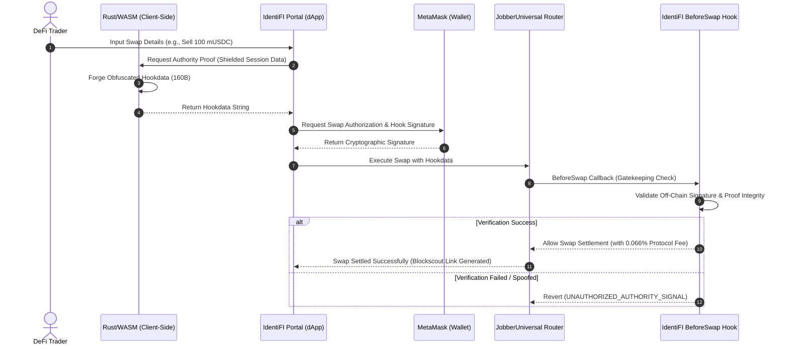

# 🪝 IdentiFI Protocol — Sovereign Privacy Hooks for Uniswap v4

[-00d9ff?style=flat-square&logo=ethereum)](https://identifiprotocol.vercel.app/)

> **Unichain Sepolia L2 Faucet & Swap Portal:** Experience the end-to-end stateless compliance flow natively on the Unichain Sepolia L2 Testnet.

---

## 🛡️ Executive Concept: The Stateless Privacy Shield

**IdentiFI Protocol** is a sovereign, *stateless* compliance and privacy framework built over Uniswap v4 Hooks. 

In modern DeFi, DEX swappers expose complete transaction strategies, key balances, and wallet relationships publicly. IdentiFI breaks this link by splitting the transaction flow into a **client-side cryptographic proof forger** (written in Rust and compiled to WebAssembly) and an **on-chain gatekeeping mechanism** integrated into Uniswap v4's execution lifecycle.

### The Core Principles
1. **Stateless Privacy & Sovereignty:** The system stores zero data. No databases, no tracking, no history. Your session proof exists in client memory and is purged immediately upon swap settlement or session termination (*The Purge*).
2. **Client-Side Proof Forging (Rust/WASM):** Cryptographically shielded payload generation happens locally in the user's browser, preventing man-in-the-middle vector leaks.
3. **The Validator-Executor Split:** The Uniswap Hook acts strictly as a sovereign validator (gatekeeper) via the `beforeSwap` callback. The optimized smart contract router `JobberUniversal` settles the trade, maximizing gas efficiency and contract decoupling.

---

## System Architecture & Transaction Flow

The interaction between the client-side Rust proof forger, the MetaMask provider, the Uniswap v4 Hook, and the Universal Router is structured as follows:

---

## Active Unichain Sepolia Testnet Deployments

To ensure absolute eligibility and frictionless evaluation for the Hookathon judges, **IdentiFI Protocol** is fully deployed on the **Unichain Sepolia L2 Testnet** (Chain ID `1301`) with all core components funded and operational:

*   **Pool Hook Address (`HOOK`):** [`0x1a74c207668D0BF33857a3A2Dc02fd7a911A4080`](https://unichain-sepolia.blockscout.com/address/0x1a74c207668D0BF33857a3A2Dc02fd7a911A4080)
*   **Router Contract (`JobberUniversal`):** [`0x86eB0886875Fd2028B92940B81aF7316bC69DbD4`](https://unichain-sepolia.blockscout.com/address/0x86eB0886875Fd2028B92940B81aF7316bC69DbD4)
*   **Dynamic Faucet Contract:** [`0x143985b680cf0A940Bc33278cbcA4F93399382AC`](https://unichain-sepolia.blockscout.com/address/0x143985b680cf0A940Bc33278cbcA4F93399382AC)
*   **Mock Tether (mUSDT):** [`0xE05454d256cE63ae75DF334ec6e0f1DC3e972E06`](https://unichain-sepolia.blockscout.com/address/0xE05454d256cE63ae75DF334ec6e0f1DC3e972E06)
*   **Mock USD Coin (mUSDC):** [`0xD1F4C92Fa1436aB2D110a02Df56224Ed0A4f5860`](https://unichain-sepolia.blockscout.com/address/0xD1F4C92Fa1436aB2D110a02Df56224Ed0A4f5860)
*   **Treasury Contract (`IdentiFITreasury`):** [`0x84D526430A9350310ccbbe4Abd739eDea929A4f1`](https://unichain-sepolia.blockscout.com/address/0x84D526430A9350310ccbbe4Abd739eDea929A4f1)

---

## Fixed Protocol Parameters

The smart contracts and client logic enforce the following business rules:
*   **Protocol Swap Fee:** Strictly set to **`0.066%`** (`0.00066` swap delta fee). Collected directly inside the settlement layer.
*   **Yield & Distribution Model (33/3 Model):** Enforces a sovereign **33/3 quarterly revenue stream model** designed to dynamically distribute accrued protocol fee rewards:
    *   **33% of generated fees** are aggregated and distributed on a quarterly basis.
    *   This yield distribution is split **50/50** between:
        *   **Decentralized Swappers:** Rewarded proportionally based on the active swap volume they generate on-chain.
        *   **Liquidity Providers (LPs):** Distributed proportionally to reward active capital backing of the modular pools.
    *   The remaining share goes directly to the **Protocol Treasury** to sustain ongoing stealth operations and cryptographic R&D.
*   **Proof Size Constraints:** Shielded authority proofs submitted via `hookData` must have a string representation strictly between **`160` bytes** to pass EVM input sanity checks.

---

## End-to-End Evaluation Guide for Judges

To interactively test and verify the entire cryptographic pipeline, follow this 4-step walkthrough:

### Step 1: Connect & Claim Mock Collateral
1. Navigate to the **[IdentiFI Web Portal](https://identifiprotocol.vercel.app/)**.
2. Click the **Claim Faucet** button located directly above the privacy documentation. 
3. The dApp will trigger a one-click transaction calling the `IdentiFIFaucet` contract on Unichain Sepolia, sending you **100 mUSDT** and **100 mUSDC** mock tokens immediately, and offering an easy 1-click option to add the custom tokens to MetaMask.

### Step 2: Forge the Off-chain Authority Proof
1. Click **Initialize Genesis** to sync your active Web3 wallet.
2. Link Cluster: Add the public addresses of your secondary wallets (the strands).
3. Secure Activation: Perform an on-chain payment through the IdentiFI contract to trigger the generation of your unique authorization credential.
4. Generate your cryptographic proof credentials inside the dApp using the dynamic Rust/WASM engine.
5. In the top-right, click **Audit Authority** to display the contained and secure data.

### Step 3: Configure and Quote the Swap
1. Open the Swap Portal (click **IdentiFI Swap** at the bottom-right).
2. Paste the generated obfuscated proof payload into the slot and hit **Process**. The `X-CORE` signal terminal will log the validation handshake.
3. Type the swap amount. The quoter will dynamically calculate the **0.066% Protocol Fee**, the estimated minimum received output based on your active slippage tolerance selectable between `0.1%`, `0.5%`, and `1.0%`, and query your real wallet token balance dynamically.

⚠️ Security Note: Swap execution is strictly gated. Only wallets explicitly authorized within your generated Proof and currently within the active session validity window will be permitted to initiate and settle a swap.

### Step 4: Execute the Secure Hook Swap
1. Hit the gradient **SWAP** button.
2. Sign the transaction in MetaMask.
3. Monitor the side **X-CORE Signal Terminal** as it prints real-time logs in the exact protocol specification format: `[TIMESTAMP] CATEGORY: MESSAGE`.
4. Upon settlement, a dynamic ciano anchor **`➥ VIEW ON BLOCKSCOUT`** will appear below the swap card. Click it to inspect your transaction real-time on the Unichain Sepolia Explorer!

---

## Partner Integrations Disclosure

> [!NOTE]
> Under Hookathon guidelines, we declare:  
> **No partner integrations.**  
> All features including the Rust WASM compilers, client-side cryptography, Uniswap v4 Hook gates, and the Custom Sepolia Faucet were designed and engineered from scratch for this Hookathon submission.

---

*Built with passion, cryptography, and Rust during the Uniswap Hook Incubator (UHI9). Let's build the future of decentralized privacy, brick by brick.* 🧱🛡️
